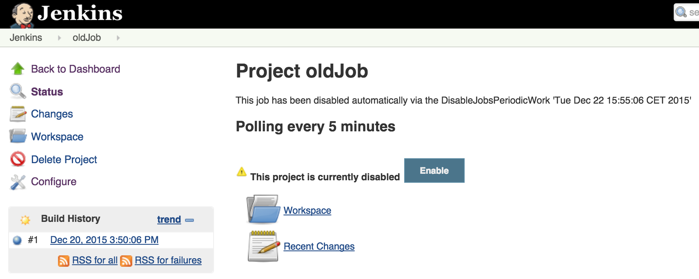

# Maintenance Jobs Scheduler Plugin

Perform some deleting or disabling of old jobs based on some cron tasks. You can configure this plugin globally based on some specific scheduler, excluding jobs with some regex, add some description in each disabling job (for tracking purposes), apply that filter for those jobs older than X days.

## Motivation

When I started to use Jenkins, I was maintaining some Jenkins jobs manually, it was a tedious task then I coded some groovy script in order to automate it as much as I could (as you can see in the above section), then I realized some organizations don't grant access to the groovy script api for some security concerns and therefore I wrote this plugin to help them and use it as a plugin, so the FOSS community can improve it if they need.

```groovy
import jenkins.model.Jenkins
int days = 365

// It will disable jobs older than X days
long purgeTime = System.currentTimeMillis() - (days * 24 * 60 * 60 * 1000);

def today = new Date()
def message =  "<i>This job has been disabled automatically " + today + "</i>\n"
Jenkins.instance?.items.findAll{ it.getLastBuild() != null &&
                                 !it.isDisabled() &&
                                 !it.getDescription().contains("This job has been disabled automatically") &&
                                 it.getLastBuild().getTimeInMillis() < purgeTime}.each { job->
    println(job.name)
    job.disable()
    job.setDescription(message + job.getDescription())
}
```

## Usage




## Development

Start the local Jenkins instance:

    mvn hpi:run

### How to install

Run

	mvn clean package

to create the plugin .hpi file.

To install:

1. copy the resulting ./target/maintenance-jobs-scheduler.hpi file to the $JENKINS_HOME/plugins directory. Don't forget to restart Jenkins afterwards.

2. or use the plugin management console (http://example.com:8080/pluginManager/advanced) to upload the hpi file. You have to restart Jenkins in order to find the plugin in the installed plugins list.

### Plugin releases

	mvn release:prepare release:perform

## Authors

Victor Martinez

## License

    The MIT License

    Copyright (c) 2015, Victor Martinez

    Permission is hereby granted, free of charge, to any person obtaining a copy
    of this software and associated documentation files (the "Software"), to deal
    in the Software without restriction, including without limitation the rights
    to use, copy, modify, merge, publish, distribute, sublicense, and/or sell
    copies of the Software, and to permit persons to whom the Software is
    furnished to do so, subject to the following conditions:

    The above copyright notice and this permission notice shall be included in
    all copies or substantial portions of the Software.

    THE SOFTWARE IS PROVIDED "AS IS", WITHOUT WARRANTY OF ANY KIND, EXPRESS OR
    IMPLIED, INCLUDING BUT NOT LIMITED TO THE WARRANTIES OF MERCHANTABILITY,
    FITNESS FOR A PARTICULAR PURPOSE AND NONINFRINGEMENT. IN NO EVENT SHALL THE
    AUTHORS OR COPYRIGHT HOLDERS BE LIABLE FOR ANY CLAIM, DAMAGES OR OTHER
    LIABILITY, WHETHER IN AN ACTION OF CONTRACT, TORT OR OTHERWISE, ARISING FROM,
    OUT OF OR IN CONNECTION WITH THE SOFTWARE OR THE USE OR OTHER DEALINGS IN
    THE SOFTWARE.
